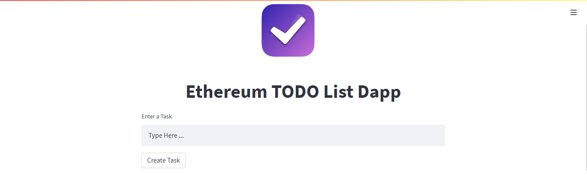

# To-Do Dapp
### This is a to-do Decentralized Application written in solidity.
&nbsp;   
# Prerequisite Software/ Packages
i) [ganache-cli](https://www.npmjs.com/package/ganache-cli#:~:text=npm%20install%20%2Dg%20ganache%2Dcli): "npm install -g ganache-cli"  
ii) [python](https://www.python.org/downloads/release/python-390/): version-3.9  
iii) [streamlit](https://docs.streamlit.io/): "pip install streamlit==3.11"  
iv) [web3](https://pypi.org/project/web3/): "pip install web3"  
v) [py-solc-x](https://pypi.org/project/py-solc-x/): "pip install py-solc-x"  
&nbsp;
# Setup and Run the Project
i) Clone the repository to your directory.  
ii) Make Sure all packages are correctly installed.  
iii) Open cmd in your directory and run the command "ganache-cli"  
iv) Open another cmd and run the command "Streamlit run Streamlit_UI.py"
### Completing these steps will run the project on your localhost at port 8501 or any other available port.
&nbsp;
# Guide to use the application
## 1. Create a task

Enter a task then press the "Create Task" button to add the task to your list.
## 2. Get Task 

Enter the task number to retrieve the task.
## 3. Check Status of Task

Enter the task number to check its status 
## 4. Toggle Task Status to True(Done)

Enter the task number to mark it as done 
## 5. Get Full Details of a task

Enter the task number to get its detail